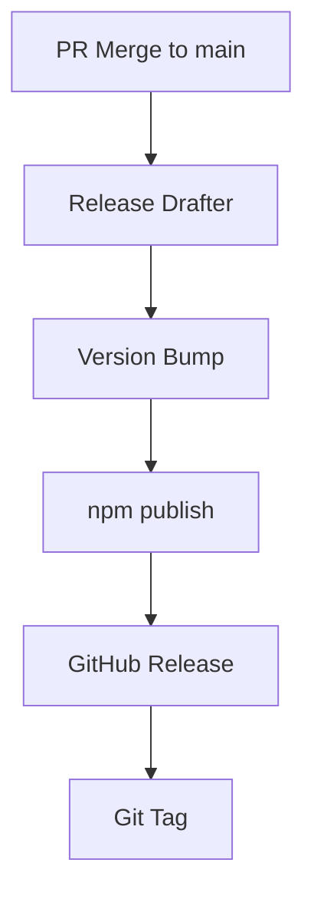

# Release Automation Design Document

## Overview

CCGWZ パッケージのリリースプロセスを自動化し、Release Drafter、package.json、npm publish を連携させる設計です。

## 現在の設定

### Release Drafter
- セマンティックバージョニング（semver）によるバージョン管理
- コミットメッセージに基づく自動ラベリング
- プルリクエストの自動分類
- リリースノートの自動生成

### Package.json
- version: `0.1.0`
- `prepublishOnly`: ビルド実行
- `publish`: npm publish 実行

### CI/CD
- CI: lint、typecheck、build
- Release Drafter: リリースドラフト作成

## 提案する自動化フロー

### 1. リリースプロセスの統合



### 2. GitHub Actions Workflow

新しいワークフロー `release.yml` を作成:

```yaml
name: Release

on:
  release:
    types: [published]

jobs:
  publish:
    runs-on: ubuntu-latest
    steps:
      - name: Checkout
        uses: actions/checkout@v4
      
      - name: Setup Bun
        uses: oven-sh/setup-bun@v1
        with:
          bun-version: latest
      
      - name: Install dependencies
        run: bun install
      
      - name: Update package.json version
        run: |
          VERSION=${GITHUB_REF#refs/tags/v}
          bun version --new-version $VERSION
      
      - name: Build
        run: bun run build
      
      - name: Publish to npm
        run: npm publish
        env:
          NODE_AUTH_TOKEN: ${{ secrets.NPM_TOKEN }}
```

### 3. Version Synchronization

#### package.json の自動更新
- GitHub Release 作成時に package.json のバージョンを自動更新
- Release Drafter のバージョンと package.json のバージョンを同期

#### Implementation Options

**Option A: Release時に自動更新**
```yaml
- name: Update package.json version
  run: |
    VERSION=${GITHUB_REF#refs/tags/v}
    npm version $VERSION --no-git-tag-version
```

**Option B: 手動バージョン管理**
```yaml
- name: Verify version consistency
  run: |
    PACKAGE_VERSION=$(node -p "require('./package.json').version")
    TAG_VERSION=${GITHUB_REF#refs/tags/v}
    if [ "$PACKAGE_VERSION" != "$TAG_VERSION" ]; then
      echo "Version mismatch: package.json=$PACKAGE_VERSION, tag=$TAG_VERSION"
      exit 1
    fi
```

### 4. リリースプロセス

#### 開発者の作業フロー
1. **Feature開発**: ブランチでコミット
2. **PR作成**: コミットメッセージに適切なプレフィックス（feat:, fix:, etc.）
3. **PR Merge**: mainブランチにマージ
4. **Release Draft確認**: 自動生成されたリリースドラフトを確認
5. **Release公開**: GitHub上でリリースを公開

#### 自動化される作業
1. **PR分析**: コミットメッセージからラベル自動付与
2. **バージョン決定**: ラベルに基づくセマンティックバージョニング
3. **リリースノート生成**: PRからchangelog自動生成
4. **NPM公開**: GitHub Release公開をトリガーに自動公開
5. **Git Tag作成**: バージョンタグの自動作成

### 5. セキュリティ考慮事項

#### NPM Token管理
- GitHub Secrets に `NPM_TOKEN` を設定
- 最小権限の原則に従い publish 権限のみ付与

#### リリース権限
- main ブランチの保護
- リリース公開権限の制限（管理者のみ）

### 6. 設定ファイルの変更

#### .github/workflows/release.yml (新規作成)
上記の Release workflow を実装

#### package.json (変更)
```json
{
  "scripts": {
    "prepublishOnly": "npm run build && npm run test",
    "release": "npm run build && npm publish"
  }
}
```

#### .github/release-drafter.yml (変更)
```yaml
version-resolver:
  major:
    labels:
      - 'breaking'
      - 'major'
  minor:
    labels:
      - 'feature'
      - 'enhancement'
      - 'feat'
  default: patch

# 自動公開設定（オプション）
publish:
  enabled: true
  draft: false
```

## 実装手順

### Phase 1: 基本設定
1. NPM Token の設定
2. release.yml ワークフローの作成
3. package.json スクリプトの更新

### Phase 2: バージョン同期
1. バージョン同期スクリプトの実装
2. CI/CD での整合性チェック
3. エラーハンドリングの追加

### Phase 3: テスト・検証
1. テストリリースの実行
2. フローの動作確認
3. ドキュメントの更新

## 利点

1. **自動化**: 手動リリース作業の削減
2. **一貫性**: バージョン管理の統一
3. **品質**: 自動テストとビルド
4. **追跡性**: 完全なリリース履歴
5. **効率性**: リリースプロセスの高速化

## 注意点

1. **初回設定**: NPM Token等の設定が必要
2. **権限管理**: リリース権限の適切な設定
3. **テスト**: 本番環境でのテストが必要
4. **バックアップ**: 手動リリース手順の維持

## まとめ

この設計により、Release Drafter、package.json、npm publish を完全に連携させ、一貫性のある自動リリースプロセスを実現できます。開発者はコミットメッセージに注意を払うだけで、残りのリリース作業は自動化されます。